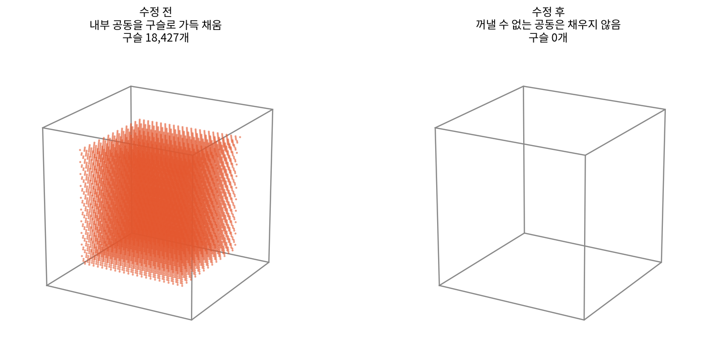
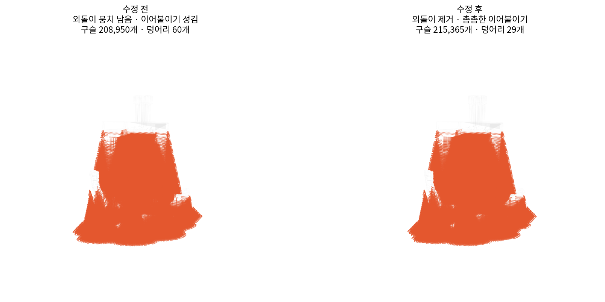

# pellet-support

3D 모델 파일을 넣으면 **최밀충전된 구형 펠릿 서포터**를 만들어 같은 포맷으로 내보내는 도구입니다.
펠릿(스크루) 익스트루더로 서포터를 뽑고, 출력 후 떼어낸 서포터를 다시 펠릿으로 회수하는
워크플로를 전제로 합니다.

슬라이서를 빌드하지 않고도 충전 파라미터를 눈으로 확인하고 튜닝할 수 있으며,
같은 배치 로직을 슬라이서에 넣기 위한 C++ 패치도 [`cpp/`](cpp/) 에 함께 들어 있습니다.

---

## 왜 구를 쌓는가

서포터를 구슬로 뽑으면 두 가지를 얻습니다. 출력물에서 잘 떨어지고(점접촉), 떼어낸 뒤
그대로 펠릿으로 재투입할 수 있습니다. 대신 구슬끼리도 잘 떨어져서 서포터 자체가
무너집니다.

이 저장소는 구슬을 **아래 세 구가 만드는 오목한 자리(hollow)** 에 앉히고, 서로 아주 살짝만
눌러 붙이는 방식으로 그 문제를 풉니다. 구 하나가 12개 이웃과 닿게 되고(배위수 12),
겹침량 `delta` 하나로 "얼마나 단단히 붙일지 ↔ 얼마나 구슬답게 남길지"를 조절합니다.

### 핵심 기하

구 세 개가 서로 맞닿아 정삼각형(한 변 = `pitch`)을 이루면, 그 hollow 는 삼각형의 무게중심
`(pitch/2, pitch·√3/6)` 입니다. 네 번째 구가 거기 앉아 세 구 모두와 `pitch` 만큼 떨어지려면
높이가 이렇게 정해집니다.

```
층높이 = √(pitch² − (pitch/√3)²) = √(2/3) · pitch = 0.8165 · pitch
```

네 구의 중심을 이으면 모서리 `pitch` 인 정사면체가 되고, 그 높이 공식과 같습니다.

> **층높이는 선택하는 값이 아니라 강제되는 값입니다.**
> 이보다 크면 구가 아래층에 안 닿아 그냥 흩어진 원판 더미가 되고,
> 작으면 다 앉기 전에 위층을 쌓아 뭉개집니다.
> 도구가 출력하는 층높이를 프린트 프로파일에 그대로 넣으세요.

### delta 고르기

접촉원 반지름은 `√(r² − (pitch/2)²)` 이라 `√delta` 로 늘고, 잃는 부피는 `delta` 로 늡니다.
**조금만 눌러도 접촉은 크게 벌어집니다.**

| delta | 접촉원지름 / D | 접촉면적 합 / D² | 충전율 | 비고 |
|------:|---------------:|-----------------:|-------:|------|
| 0.00  | 0.00 | 0.00 | 0.74 | 이론상 최밀충전, 고정력 0 |
| 0.02  | 0.20 | 0.37 | 0.78 | |
| 0.04  | 0.28 | 0.74 | 0.83 | 몸통 권장 |
| 0.06  | 0.34 | 1.10 | 0.86 | |
| 0.08  | 0.39 | 1.45 | 0.90 | 인터페이스 권장 (기본값) |
| 0.12  | 0.48 | 2.13 | 0.95 | 사실상 통짜, 비권장 |

D=1mm 에 delta=0.08 이면 눌린 자국 지름이 0.39mm 뿐이라 여전히 구인데, 12개 접촉면의
합이 대원 단면적(0.785 D²)의 1.8배입니다.

### 재료에 대한 솔직한 경고

최밀충전은 정의상 조밀합니다. 충전율이 0.90 까지 올라가서, 성긴 격자(pitch 2.0D) 대비
재료와 시간이 5배 수준입니다. 펠릿으로 회수·재사용하는 설계라면 **순 재료 손실은 작지만
출력 시간은 그대로 비용**입니다. 줄이려면 `--body-bead-ratio` 를 낮춰 몸통 구만 작게
만드세요. 격자 pitch 는 오브젝트 전체가 공유해야 하므로(안 그러면 수직 안착이 깨집니다)
겹침을 줄이는 방법은 구 지름을 줄이는 것뿐입니다.

---

## 설치

```bash
git clone https://github.com/<YOUR_ID>/pellet-support.git
cd pellet-support
pip install -e ".[dev,web]"
```

Python 3.9 이상. 핵심 의존성은 `trimesh[easy]`(3MF/STL 로딩·슬라이싱·삼각분할에
필요한 선택 패키지 묶음), `shapely`, `numpy` 이고,
`matplotlib`(미리보기), `scipy`(배치 검증), `flask`(웹 UI)는 없어도 나머지가 동작합니다.

## 문서

코드가 실제로 어떻게 동작하는지 — 변수 설정, 펠릿 위치 설정(격자·최밀충전 기하),
펠릿 크기 설정(겹침량·접촉원·부피) — 를 3D 그림과 함께 정리한 문서입니다.

**[docs/PARAMETER_GUIDE.md](docs/PARAMETER_GUIDE.md)**

## 웹 UI로 쓰기 (권장)

```bash
pellet-support-web
```

브라우저가 열리면 모델 파일을 끌어다 놓고 **서포터 만들기**를 누르면 됩니다.
파라미터를 만지는 즉시 오른쪽 판독기가 pitch, 층높이, 접촉원 지름, 충전율을
다시 계산하고, 아래 격자 그림이 다음 층 구슬이 오목한 자리에 어떻게 앉는지
실제 비율로 보여줍니다.

VS Code 에서는 좌측 **실행 및 디버그** 패널에서 `웹 UI 실행` 을 고르고 F5 를
누르면 같은 결과입니다.

> **GitHub Pages 로는 호스팅할 수 없습니다.** Pages 는 정적 파일만 서빙해서
> 파이썬을 실행하지 못합니다. `trimesh` / `shapely` 가 서버에서 돌아야 하므로
> 로컬에서 띄우거나, 직접 관리하는 서버(Render, Fly.io, 사내 서버 등)에
> 올려야 합니다. 저장소의 Pages 를 켜면 이 README 만 보이는 이유입니다.

## 명령줄로 쓰기

```bash
# 가장 단순한 실행 — 노즐 지름만 주면 나머지는 자동
pellet-support model.stl --nozzle 1.0

# 미리보기 + 합본 + 좌표 덤프
pellet-support model.3mf --nozzle 1.2 --overlap 0.06 \
    --preview -1 --with-model --dump-json

# 테스트 모델 만들어 보기
python examples/make_test_models.py
pellet-support examples/out/table.stl --nozzle 1.0 --preview -1
```

실행하면 이런 출력이 나옵니다.

```
[2/4] 충전 기하
      pitch = 0.920 mm,  층높이 = 0.751 mm  <- 프로파일에 이 값을 쓰세요
      [contact] D=1.000  delta=0.080  접촉원지름=0.392mm  배위수=12  충전율=0.90  mm3/mm=3.295
      [body   ] D=0.970  delta=0.052  접촉원지름=0.307mm  배위수=12  충전율=0.85  mm3/mm=3.207
[3/4] 오버행 탐색 + bead 배치
      bead 6433개
      삼각형 515788개, 부피 약 3.05 cm^3
      검증: 최근접거리 중앙값 0.920 mm (목표 0.920), 배위수 중앙값 12
```

마지막 **검증** 줄이 중요합니다. 설계값이 아니라 실제로 찍힌 좌표에서 잰 값이라,
배위수가 12가 아니면 파라미터 조합이 잘못됐다는 신호입니다.

### 미리보기

`--preview` 로 나오는 PNG 는 해당 층 구를 채운 원으로, 바로 위 층을 점선으로 겹쳐
그립니다. 점선이 아래층 세 구 사이 오목한 자리에 정확히 들어가면 충전이 성립한
것입니다.


### 결과물 활용

`model_support.stl` 은 **원본 모델과 별개의 오브젝트**로 슬라이서에 불러옵니다.

1. 슬라이서에서 원본 모델과 서포터 STL 을 같이 로드 (좌표계가 같으므로 그대로 겹칩니다)
2. 서포터 오브젝트를 서포터 익스트루더(T1)에 할당
3. 층높이를 위에서 출력된 값(예: 0.751mm)으로 설정
4. 슬라이서 자체 서포터 기능은 **끄기**

`--dump-json` 으로 나온 좌표 파일은 C++ 구현 결과와 좌표 단위로 대조할 때 씁니다.

### 주요 옵션

| 옵션 | 기본값 | 설명 |
|------|--------|------|
| `--nozzle` | 1.0 | 서포터 익스트루더 노즐 지름 (압출 최소 크기 기준) |
| `--bead-diameter` | 노즐×0.5 | 구슬 지름. 노즐보다 작게 잡을수록 gap/interface 사각지대가 줄지만 인쇄 시간은 늘어남 |
| `--overlap` | 0.08 | delta. 이웃과 눌리는 정도 |
| `--lateral-overlap` | (delta) | 가로 겹침. 좌우 흔들림에 버티는 힘 |
| `--vertical-overlap` | (delta) | 세로 겹침. 작을수록 펠릿으로 잘 부서짐 |
| `--body-bead-ratio` | 0.97 | 몸통 구 지름 / 인터페이스 구 지름 |
| `--stagger-period` | 3 | 2=ABAB(hcp), 3=ABCABC(fcc) |
| `--straight-columns` | off | 충전을 끄고 수직 기둥으로 (배위수 8) |
| `--layer-height` | 자동 | 비우면 충전 기하에서 계산 (권장) |
| `--overhang-angle` | 45 | 수평 기준 이 각도보다 완만하면 지지 |
| `--xy-clearance` | 0.8 | 모델 벽면과의 XY 틈 |
| `--z-gap-layers` | 1 | 모델 아랫면과의 Z 틈 (층 수) |
| `--contact-layers` | 2 | 위에서 몇 층을 인터페이스로 볼지 |
| `--sphere-detail` | 1 | 0=20면, 1=80면, 2=320면 |
| `--build-plate-only` | off | 베드에 닿는 기둥만 남김 |
| `--allow-internal-supports` | off | 모델 내부의 닫힌 공동에도 채움 |

전체 목록은 `pellet-support --help`.

## 라이브러리로 쓰기

```python
import trimesh
from pellet_support import SupportGenParams, generate_support, make_params

mesh = trimesh.load("model.stl", force="mesh")
mesh.apply_translation([0, 0, -mesh.bounds[0][2]])

contact, body = make_params(nozzle_diameter_mm=1.0, overlap=0.06)
gen = SupportGenParams(layer_height_mm=contact.layer_height_mm())

result = generate_support(mesh, gen, contact, body)
result.mesh.export("support.stl")
```

## 구조

```
src/pellet_support/
  params.py     충전 기하. 설계 변수는 D 와 delta 둘뿐이고 나머지는 전부 유도된다
  slicing.py    메쉬 -> 층별 폴리곤
  regions.py    오버행 탐지 -> 서포터가 차지할 영역
  lattice.py    영역 안에 구 중심 배치 (C++ 이식본)
  meshing.py    배치 계획 -> 실제 구 메쉬
  report.py     리포트, 검증, 미리보기, 좌표 덤프
  pipeline.py   위를 묶는 진입점
  cli.py        커맨드라인
  webapp.py     로컬 웹 UI (Flask)
  templates/    웹 UI 페이지
.vscode/        VS Code 실행 설정 (F5 로 웹 UI 실행)
cpp/            슬라이서에 넣을 C++ 패치
tests/          34개 테스트 (기하 해석해 대조 + 실제 배치 측정 + 웹 엔드포인트)
```

전체를 관통하는 원칙 하나: **격자 원점과 pitch 는 오브젝트 전체에서 딱 한 번 정해지고,
이후 모든 층·모든 영역이 그 하나의 좌표계를 절대 기준으로 참조합니다.** 층마다 원점이
흔들리면 시프트를 아무리 정확히 줘도 아래층 hollow 에 안 떨어집니다.

## 테스트

```bash
pytest -v
```

34개 전부 통과합니다. 해석적으로 푼 값과 대조하는 테스트(정사면체 높이를 좌표로 직접 계산해 상수와 비교,
접촉원이 √delta 로 커지는지, 맞닿은 구의 충전율이 이론값 0.7405 인지)와,
실제 생성된 좌표를 KD-tree 로 재서 배위수 12를 확인하는 테스트가 함께 들어 있습니다.

### 내부 공동은 채우지 않습니다

속이 빈 상자나 선체 안쪽처럼 **사방이 막힌 공간**에는 기본적으로 서포터를
만들지 않습니다. 출력 후 꺼낼 방법이 없어서 재료·시간·무게만 버리기 때문입니다.
아치 아래나 U자 홈, 터널처럼 **위나 옆이 트인 공간**은 정상적으로 채웁니다.
꼭 필요하면 `--allow-internal-supports` 로 되살릴 수 있습니다.



### 구슬 지름은 노즐 지름과 다릅니다

표준 FDM 이 층높이를 노즐 지름의 25~75% 로 쓰는 것과 같은 논리로, 구슬
지름도 노즐 지름과 똑같을 필요가 없습니다. 오히려 똑같이 맞추면
gap/interface/edge_margin 이 전부 구슬 지름에 비례해 커져서, 굵은 펠릿
노즐일수록 서포터 위쪽에 큰 사각지대가 생깁니다(8mm 노즐 기준 최대 32%).
기본값은 노즐의 절반이고, `--bead-diameter` 로 직접 지정할 수 있습니다.
작게 잡을수록 사각지대는 줄지만 같은 면적을 채우는 구슬 개수가 늘어
인쇄 시간이 길어지는 트레이드오프가 있습니다.

### 입력 검증

물리적으로 성립하지 않는 값은 조용히 이상한 결과를 내는 대신 명확한 에러로
막습니다(겹침 1 이상, 음수 여유, 지름 0, 오버행 각도 0/90 등). 구슬 수가
상한(`--max-beads`, 기본 300만)을 넘으면 메모리가 터지기 전에 미리 중단하고
무엇을 바꿔야 하는지 알려줍니다.

### 비등방 충전 (좌우 흔들림 대응)

기본은 모든 방향의 겹침이 같은 등방 충전입니다. `--lateral-overlap` 과
`--vertical-overlap` 을 함께 주면 **가로만 강하게, 세로는 약하게** 만들 수
있습니다. 층 높이를 `h = sqrt(d_세로^2 - pitch^2/3)` 으로 역산하는 방식이라
구슬 크기는 그대로 둔 채 방향별 강도만 바꿉니다.

플레이트가 좌우로 흔들릴 때 버티는 것은 '가로 넥'이고, '세로 넥'은 약할수록
펠릿으로 잘 부서집니다. 즉 약한 방향을 분리하고 싶은 방향으로 몰아주는 설정입니다.

구슬 1.5mm 기준 실제 측정값(좌우 2g 흔들림, 내장 시뮬레이터):

| 설정 | 가로 넥 | 세로 넥 | 안전율 | 충전율 |
|---|---|---|---|---|
| 등방 0.08 | 0.271 mm² | 0.271 mm² | 361,035 | 0.95 |
| 가로 0.14 / 세로 0.04 | 0.460 mm² | 0.139 mm² | 1,616,217 | 0.99 |

```bash
pellet-support model.stl --bead-diameter 1.5 \
    --lateral-overlap 0.14 --vertical-overlap 0.04
```

대신 구슬 수가 3배 가까이 늘어 인쇄 시간이 그만큼 길어집니다.

> 시뮬레이터는 축력과 전단만 보고 굽힘·비틀림은 무시하는 정적 해석입니다.
> 안전율 절대값은 PLA 물성 기본값 기준이므로, **설정 간 상대 비교용**으로만
> 보세요.

### 외톨이 구슬 뭉치 제거

베드에 얹혀 있어도 모델을 전혀 받치지 않는 구슬 뭉치는 지웁니다. 재료만 쓰고,
인쇄 중 노즐에 걸려 떨어져 나가면 다른 곳까지 망치기 때문입니다. 모델 표면까지의
최단 거리가 `Z간격 + 구슬지름 + XY여유` 보다 멀면 그 뭉치는 제거 대상입니다.
`--no-prune-orphans` 로 끌 수 있습니다.



## 한계

- 오버행 탐지는 인접 층 단면의 차집합 기반이라, 슬라이서의 트리 서포터처럼
  정교하지는 않습니다. 완만한 곡면에서는 `--overhang-angle` 조정이 필요합니다.
  탐지 슬라이싱은 구슬 격자 간격과 분리돼 있어(기본 0.4mm 이하) 펠릿을 굵게
  잡아도 오버행을 놓치지 않습니다.
- 굵은 펠릿(예: 5mm)은 폭이 좁은 오버행 영역을 물리적으로 채울 수 없어
  구슬 수가 급격히 줄어듭니다. 이건 버그가 아니라 기하학적 한계입니다.
- 출력 메쉬는 구가 서로 겹친 상태로 나옵니다. 대부분의 슬라이서가 합집합으로
  처리하지만, 단일 매니폴드가 필요하면 별도 boolean union 이 필요합니다.
- `--stagger-period` 를 켠 상태에서 구 개수가 많으면 삼각형 수가 급증합니다.
  미리보기 목적이면 `--sphere-detail 0` 을 쓰세요.
- trimesh 는 포맷·기능별 의존성을 전부 선택 설치로 둡니다(3MF 로딩엔 networkx·lxml,
  단면 폴리곤 복원엔 scipy·rtree, 삼각분할엔 mapbox-earcut). `trimesh[easy]` 로
  한 번에 해결하며, 예전 버전을 설치하셨다면 `pip install "trimesh[easy]"` 로
  업그레이드하세요.
- 웹 UI 는 1인용 로컬 도구입니다. Flask 개발 서버를 쓰고 인증이 없으므로
  공개 네트워크에 그대로 노출하지 마세요.

## 라이선스

MIT. [LICENSE](LICENSE) 참조.
