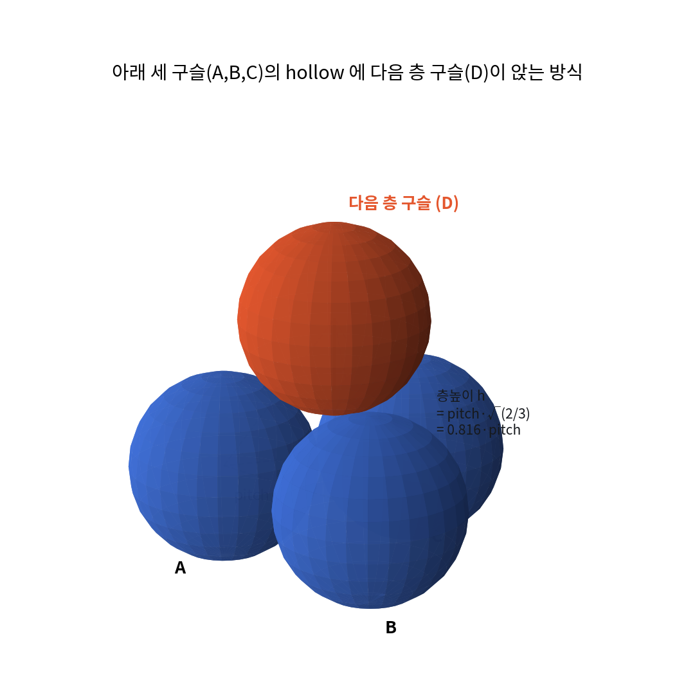
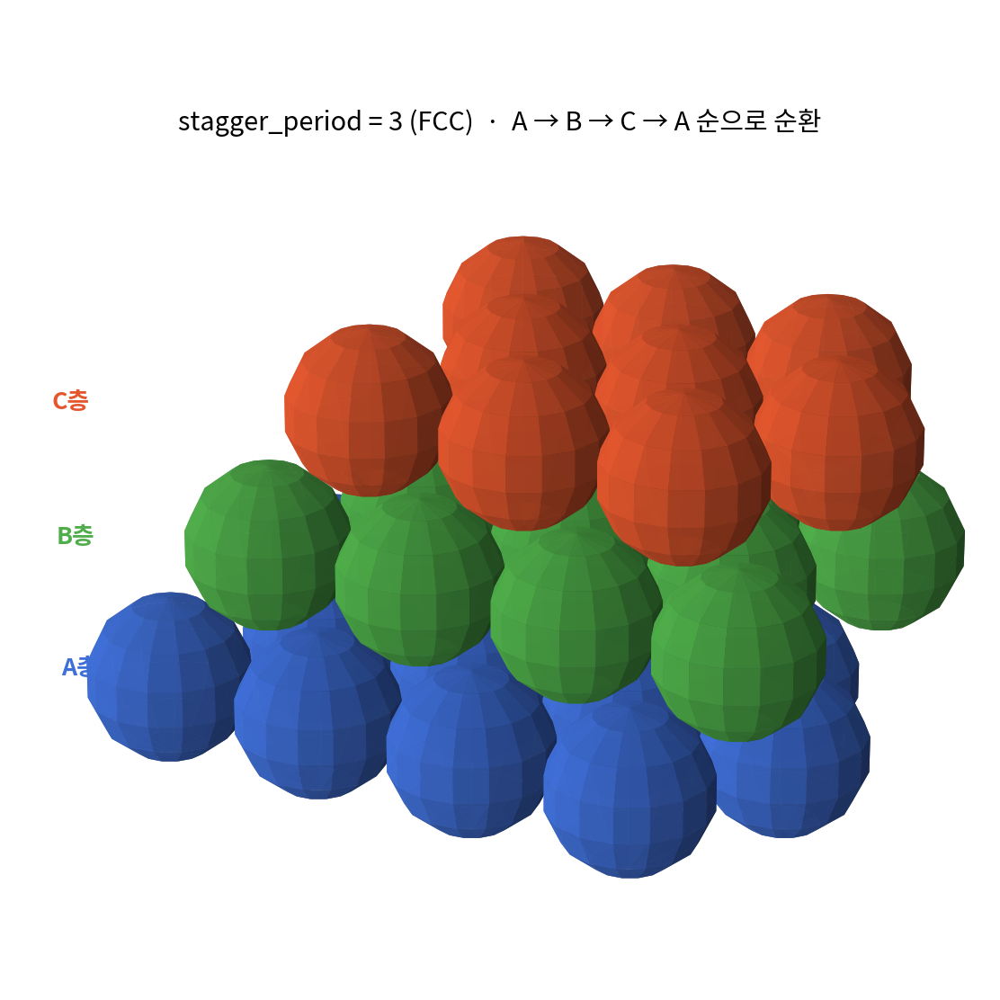
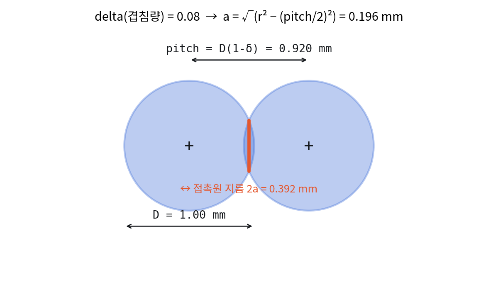
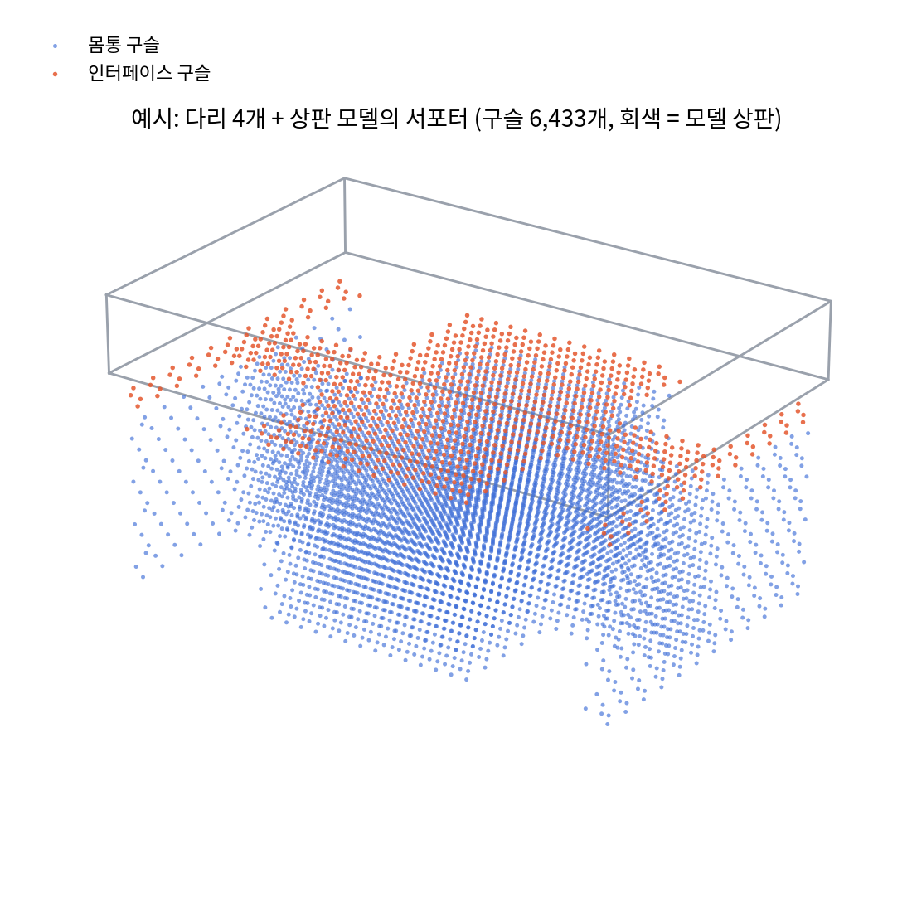

# 펠릿 서포터 생성기 — 동작 원리와 파라미터 가이드

이 문서는 `pellet-support` 가 내부적으로 어떻게 동작하는지, 어떤 변수를 만지면
무엇이 바뀌는지를 코드 순서대로 설명합니다. 단일 노즐로 인쇄한다는 전제,
즉 **이 프로그램이 뱉어내는 파일 자체가 최종 출력물**이라는 전제로 씁니다 —
슬라이서의 서포터 기능은 쓰지 않고, 모델과 서포터가 이미 하나로 합쳐진 결과물을
그대로 STL/3MF로 받아 형식만 바꿔 인쇄합니다.

---

## 0. 출력 방식에 대한 중요한 정정

이전에 "프로파일 층높이를 반드시 이 값으로 맞추세요"라고 여러 번 말씀드렸는데,
**단일 노즐로 이 프로그램의 산출물을 그대로 인쇄하는 지금의 워크플로에서는 그 말이
틀렸습니다.** 바로잡습니다.

이 프로그램은 bead 하나하나를 실제 3D 구(sphere) 메쉬로 미리 구워서(`meshing.py`)
STL/3MF 안에 박아 넣습니다. 그 파일은 이후 어떤 슬라이서로 열어도 **그냥 울퉁불퉁한
고체 덩어리 하나**일 뿐입니다. 슬라이서가 그 파일을 슬라이싱할 때 쓰는 층높이는
당신이 슬라이서에서 고른 값이고, 그 값이 얼마든 상관없이 이미 확정된 구 표면을
정확히 잘라냅니다 — 도자기 그릇을 어떤 두께로 스캔하든 그릇 모양 자체는 안 변하는
것과 같습니다.

`layer_height_mm` 이 강제되는 층높이는 **이 프로그램이 구 중심을 어디에 찍을지
계산하는 그 순간에만** 의미가 있고, 코드 안에서 이미 자동으로 처리됩니다.
사용자가 슬라이서에서 그 값을 다시 맞출 필요가 없습니다.

다만 실용적인 이유로 권장 사항은 하나 있습니다. 슬라이서 층높이를 구 지름보다
너무 크게 잡으면(예: D=1mm 인데 층높이 2mm) 울퉁불퉁한 표면이 뭉개져서 밋밋한
덩어리로 인쇄됩니다. **슬라이서 층높이는 대략 `bead_diameter_mm / 3` 이하로
잡으시면** 구 모양이 잘 살아서 인쇄됩니다.

---

## 1. 전체 동작 흐름

```
모델 파일 (.stl/.obj/.3mf/.ply)
        │  load_mesh()                              [report.py]
        ▼
   3D 메쉬 (trimesh.Trimesh)
        │  slice_model()                            [slicing.py]
        ▼
   층별 2D 단면 폴리곤 (shapely)
        │  build_support_regions()                  [regions.py]
        ▼
   층별 (서포터 영역, 인터페이스 영역) 폴리곤 쌍
        │  plan_beads() → support_bead_generate_centers()   [meshing.py, lattice.py]
        ▼
   층별 구슬 중심 좌표 목록 (BeadPlan)
        │  plan_to_mesh()                           [meshing.py]
        ▼
   구슬을 실제 구 메쉬로 합친 최종 3D 솔리드
        │  .export()
        ▼
   서포터 파일 (.stl/.obj/.3mf/.ply)
```

각 단계가 어떤 변수를 쓰는지 아래에서 따라가겠습니다.

---

## 2. 변수 설정

변수는 두 그룹으로 나뉩니다. **`SupportGenParams`** (params.py) 는 "어디에
서포터를 놓을지"를 정하고, **`SupportBeadParams`** 는 "그 자리에 놓일 구슬이
어떻게 생겼는지"를 정합니다. 실질적인 설계 변수는 딱 두 개, 구슬 지름 `D`
(`bead_diameter_mm`) 와 겹침량 `delta` (`lattice_overlap_ratio`) 뿐이고,
나머지 유도값(층높이, 접촉원, 부피, 충전율)은 이 두 값에서 자동으로 계산됩니다.

### 2.1 서포터 영역 변수 — `SupportGenParams`

| 변수 | 기본값 | CLI 플래그 | 의미 |
|---|---|---|---|
| `nozzle_diameter_mm` | 1.0 | `--nozzle` | 구슬 지름의 기준. 실제 사용 중인 노즐 지름을 입력 |
| `layer_height_mm` | 자동계산 | `--layer-height` | **구슬 배치** 격자 간격. 비워두면 충전 기하에서 자동 계산 (권장) |
| `detection_layer_height_mm` | 자동(≤0.4) | — | **오버행 탐지** 슬라이싱 두께. 구슬 크기와 분리돼 있어야 굵은 펠릿에서도 오버행을 놓치지 않는다 |
| `overhang_angle_deg` | 45 | `--overhang-angle` | 수평 기준 이 각도보다 완만하면 "지지 필요"로 판정 |
| `contact_z_gap_layers` | 1 | `--z-gap-layers` | 모델 아랫면과 서포터 사이에 띄우는 층 수 |
| `xy_clearance_mm` | 0.8 | `--xy-clearance` | 서포터와 모델 벽면 사이 수평 틈 |
| `contact_layers` | 2 | `--contact-layers` | 서포터 상단 몇 층을 "인터페이스"로 볼지 |
| `solid_first_layers` | 0 | (고정) | 첫 층을 구슬 대신 통판으로 채울 층 수. 통판은 펠릿으로 안 부서지고 큰 판때기로 남으므로 기본은 0 |
| `min_island_area_mm2` | 2.0 | `--min-island-area` | 이보다 작은 오버행 조각은 노이즈로 보고 무시 |
| `support_on_build_plate_only` | False | `--build-plate-only` | 켜면 베드에 직접 닿는 기둥만 남기고 나머지는 버림 |
| `max_layers` | 4000 | `--max-layers` | 안전장치. 이 이상 층이 나오면 계산을 멈추고 에러 |

`overhang_angle_deg` 를 올리면(예: 60~70) 더 완만한 경사까지 서포터가 붙어서
안전해지지만 서포터 양이 늘어납니다. `xy_clearance_mm` 를 줄이면 서포터가 모델에
더 바짝 붙어 지지력은 좋아지지만 떼어낼 때 모델 표면에 자국이 남을 수 있습니다.

### 2.2 구슬 모양 변수 — `SupportBeadParams`

| 변수 | 기본값(contact/body) | CLI 플래그 | 의미 |
|---|---|---|---|
| `bead_diameter_mm` | nozzle / nozzle×0.97 | `--nozzle`, `--body-bead-ratio` | 구슬 지름 D |
| `lattice_overlap_ratio` | 0.08 / (자동, `unify_lattice`가 역산) | `--overlap` | 겹침량 delta. 0.04~0.08 권장 |
| `edge_margin_ratio` | 0.4 / 0.5 | `--edge-margin-ratio` | 영역 가장자리에서 구슬 중심을 얼마나 안쪽으로 뺄지 (× D) |
| `segment_ratio` | 0.15 | `--segment-ratio` | (메쉬 생성에는 미사용. C++ 이식 시 압출 선분 길이 비율) |
| `stagger_layers` | True | `--straight-columns` (끄는 옵션) | True = 최밀충전(배위수 12), False = 수직 기둥(배위수 8) |
| `stagger_period` | 3 | `--stagger-period` | 2 = ABAB(hcp), 3 = ABCABC(fcc) |
| `snake_order` | True | (고정) | 이동 경로 최적화용. 구슬 위치 자체에는 영향 없음 |
| `alternate_contact_angle` | True | (고정) | 압출 선분 각도를 층마다 회전 (메쉬 생성에는 시각적으로 영향 없음) |
| `flow_multiplier` | 1.0 | (고정) | (C++ 이식 시 압출량 보정용) |

`--overlap` 이 가장 자주 만지게 될 값입니다. 낮추면 구슬 모양이 살아 분리가
쉬워지고, 높이면 서로 단단히 붙어 구조가 튼튼해지는 대신 통짜에 가까워집니다.

---

## 3. 펠릿 위치 설정 — 구슬을 "어디에" 찍는가

핵심 코드는 `lattice.py` 의 `support_bead_generate_centers()` 입니다.

### 3.1 격자 원점 (`grid_origin`)

`pipeline.py` 의 `generate_support()` 에서 **오브젝트 전체의 bbox 최솟값 꼭짓점**
`(mesh.bounds[0][0], mesh.bounds[0][1])` 을 딱 한 번 계산해서 모든 층·모든 영역에
그대로 넘깁니다. 이 원점이 층마다 달라지면 위아래 층의 시프트가 서로 어긋나서
아래층 hollow 에 정확히 안착하지 못합니다. bbox 가 무엇인지는 도형을 이루는 모든
점의 x/y 최솟값·최댓값을 그냥 골라내는 것뿐입니다 — 별도 계산식이 없습니다.

### 3.2 같은 층 안의 격자 (정삼각형 배열)

```python
pitch_x = pitch_mm
pitch_y = pitch_mm * sqrt(3) / 2
```

한 행 안에서는 `pitch` 간격으로, 행과 행 사이는 `pitch × √3/2` 간격으로 점을
찍습니다. 홀수 행은 `pitch_x/2` 만큼 옆으로 밀려서 벌집(육각) 모양이 됩니다.

### 3.3 층 사이 시프트 (최밀충전의 핵심)

아래 세 구슬(A, B, C)이 만드는 오목한 자리(hollow)는 그 삼각형의 무게중심,
좌표로는 `(pitch_x/2, pitch_y/3)` 입니다. 이 시프트를 층 번호만큼 반복 누적하면
A → B → C 를 돌고 `stagger_period` 층 만에 다시 A 로 돌아옵니다.

```python
k = support_layer_id % stagger_period
layer_shift_x = k * (pitch_x / 2)
layer_shift_y = k * (pitch_y / 3)
```



이 시프트 덕분에 위 구슬은 아래 세 구슬 모두와 정확히 `pitch` 만큼 떨어지고,
그 결과 이웃 12개(같은 층에서 6개 + 아래층 3개 + 위층 3개)와 닿는 구조가 됩니다.
`stagger_period=3` 이면 아래처럼 세 층이 순환합니다.



`--stagger-period 2` 로 바꾸면 A → B → A 만 반복하는 HCP 가 되는데, 역학적으로는
거의 차이가 없고 FCC(3) 쪽이 이음매가 세 층에 걸쳐 분산돼 살짝 더 매끈합니다.

`--straight-columns` 를 켜면 이 시프트 계산 자체를 건너뛰어서 구슬이 그냥 수직으로
쌓입니다(이웃 8개, 원래 v1 버전의 동작).

### 3.4 영역 경계 처리

`edge_margin_ratio × D` 만큼 영역을 안쪽으로 줄인(shrink) 뒤 그 안에서만 격자점을
채택합니다. 다만 아주 얇은 인터페이스 조각은 이 축소로 통째로 사라질 수 있어서,
그럴 땐 원본 영역으로 되돌리고 "중심점이 영역 안에 있는가"만으로 판정합니다
(코드 주석의 "thin interface islands" 폴백).

---

## 4. 펠릿 크기 설정 — 구슬을 "얼마나 크게, 얼마나 눌러서" 찍는가

핵심 코드는 `params.py` 의 `SupportBeadParams` 메서드들입니다. 설계 변수는
`bead_diameter_mm`(D)와 `lattice_overlap_ratio`(delta) 둘뿐입니다.



```python
pitch = D * (1 - delta)                       # 구슬 중심 사이 거리
layer_height = pitch * sqrt(2/3)              # 강제되는 내부 층높이 (설계 시에만 사용)
contact_disc_radius = sqrt(r² - (pitch/2)²)   # 눌린 자국의 반지름
```

접촉원은 `√delta` 로 커지는데 잃는 부피는 `delta` 로 커집니다. 그래서 조금만
눌러도 접촉은 크게 벌어집니다.

| delta | 접촉원지름/D | 충전율 | 비고 |
|---|---|---|---|
| 0.00 | 0.00 | 0.74 | 점접촉, 고정력 없음 |
| 0.04 | 0.28 | 0.83 | 몸통 권장 |
| 0.08 | 0.39 | 0.90 | 인터페이스 권장(기본값) |
| 0.12 | 0.48 | 0.95 | 사실상 통짜, 비권장 |

### 4.1 인터페이스와 몸통이 다른 크기를 쓰는 이유

같은 오브젝트는 격자(pitch) 하나를 공유해야 위아래 층이 어긋나지 않습니다
(`unify_lattice()`). 그래서 몸통의 delta 를 독립적으로 지정할 수 없고, 대신
`--body-bead-ratio`(기본 0.97)로 **몸통 구슬만 살짝 작게** 만들어서 같은 pitch
위에서 결과적으로 겹침이 낮아지게 합니다. 겹침이 낮을수록 펠릿으로 잘 부서집니다.

### 4.2 재료량 확인

```python
bead_volume = (4/3)π r³ − 배위수 × 구관(spherical cap) 부피
```

콘솔에 뜨는 `mm3/mm` 값이 이 부피를 압출 선분 길이로 나눈 값이고, C++ 이식판에서
실시간 압출량으로 그대로 씁니다. 이 파이썬 도구에서는 최종 메쉬 부피(`cm³`)로
직접 확인할 수 있습니다.

---

## 5. 실행 예시

```bash
pellet-support model.stl --nozzle 1.0 --overlap 0.08 --with-model --format .stl
```

`--with-model` 을 켜면 모델과 서포터가 이미 하나로 합쳐진 파일이 나옵니다 —
단일 노즐 워크플로에서는 **이 파일을 그대로 슬라이서에 넣고 인쇄하면 끝**입니다.
별도로 서포터를 켤 필요도, 오브젝트를 나눠 익스트루더를 배정할 필요도 없습니다.

다리 4개 + 상판 모델로 돌리면 이런 구조가 나옵니다.



파란 점이 몸통 구슬(6,433개 중 대부분), 주황 점이 상판 바로 아래 인터페이스
구슬입니다. 다리가 있는 네 구역에는 `xy_clearance_mm` 때문에 구슬이 비어 있는
것도 보입니다. 층별 2D 단면은 `--preview` 로 따로 확인할 수 있습니다
(`docs/preview_layer.png` 예시 참고).

---

## 6. 요약 — 뭘 조정하면 뭐가 바뀌는가

| 하고 싶은 것 | 만질 변수 |
|---|---|
| 서포터가 더 잘 떨어지게 | `--overlap` 낮추기 (예: 0.06 → 0.04) |
| 서포터가 더 튼튼하게 | `--overlap` 높이기 (0.12 넘기지 않기) |
| 서포터 양(재료·시간) 줄이기 | `--body-bead-ratio` 낮추기, `--overhang-angle` 낮추기 |
| 서포터가 모델에 자국 안 남기게 | `--xy-clearance` 올리기 |
| 인쇄 표면 텍스처를 매끈하게 | 슬라이서 층높이를 `D/3` 이하로 |
| 완만한 곡면도 더 많이 지지 | `--overhang-angle` 올리기 |
| 구슬 배위수(강도) 극대화 | 기본값(최밀충전) 유지, `--straight-columns` 쓰지 않기 |
